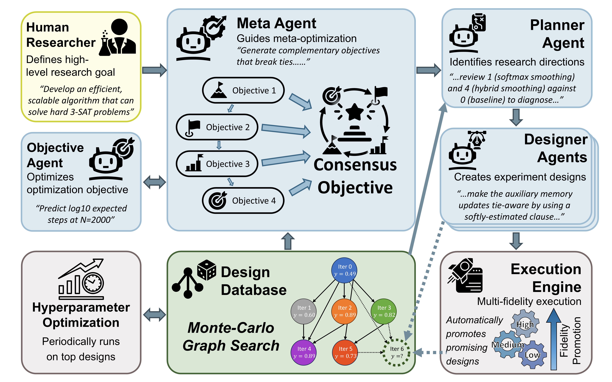

# Scientific Discovery as Meta-Optimization

Code for the paper: *Scientific discovery as meta-optimization: a combinatorial optimization case study*
by Yuan-Hang Zhang, Chesson Sipling, and Massimiliano Di Ventra.
[[Paper](https://www.researchsquare.com/article/rs-9108409/v1)]

An LLM-driven automated research system that simultaneously optimizes both solutions and the evaluation criteria used to guide the search. Multiple LLM-generated proxy objectives are aggregated through a correlation-weighted consensus mechanism that self-corrects against reward hacking and Goodhart's law.

**Case study result**: Applied to 3-SAT algorithm discovery, the system reduced the scaling exponent of a Digital MemComputing Machine solver from N<sup>2.51</sup> to N<sup>1.33</sup> (~67x speedup on the largest tested instances), exploring 414 solver designs under guidance of 42 co-evolving objectives.

## Claude Code Skill

A ready-to-use [Claude Code](https://docs.anthropic.com/en/docs/claude-code) skill implementing the meta-optimization algorithm is available at **[yuanhangzhang98/meta-discovery](https://github.com/yuanhangzhang98/meta-discovery)**. Install the skill to apply the framework to your own project directly from the command line, without needing to set up this codebase manually.

## Architecture

<p align="center">
  
</p>

**Four LLM agents** operate in an iterative cycle:

| Agent | Role |
|-------|------|
| **Meta-Agent** | Analyzes objective effectiveness via Kendall τ correlations; assigns weight multipliers to amplify or suppress objectives |
| **Planner** | Uses Monte Carlo Graph Search (MCGS) to rank designs; identifies promising research directions |
| **Designer** | Writes solver code, runs multi-fidelity experiments, reflects on results |
| **Objective Agent** | Generates new proxy objective functions guided by meta-agent directions |

**Consensus objective aggregation** combines all objectives into a robust ranking:
1. Score each design under each objective
2. Convert to ranks; compute pairwise Kendall τ correlations
3. Weight by median agreement × age decay (λ=0.9) × meta-agent multiplier
4. Aggregate via weighted Borda count

## Installation

**Requirements**: Python 3.10, CUDA-capable GPU (for PyTorch solver execution)

```bash
# Create conda environment
conda create -n meta_opt python=3.10
conda activate meta_opt

# Install dependencies
pip install -r requirements.txt

# Set OpenAI API key
export OPENAI_API_KEY="your-key-here"
```

> **Note**: HEBO requires `numpy<1.25` and `Python<=3.10`. These constraints are pinned in `requirements.txt`.

## Quick Start

```bash
# Run the full optimization loop (10 iterations, meta-agent enabled)
python scripts/orchestrator.py --iterations 10

# Customize the run
python scripts/orchestrator.py \
    --iterations 50 \
    --num-designers 3 \
    --objective-frequency 10 \
    --models gpt-5.2

# Use workspace isolation for parallel runs
python scripts/orchestrator.py --workspace run_01 --iterations 20
```

Key arguments:

| Argument | Default | Description |
|----------|---------|-------------|
| `--iterations` | 10 | Number of planner/designer rounds |
| `--num-designers` | 2 | Designer agents per planner round |
| `--models` | gpt-5.2 | LLM model(s) to rotate through |
| `--objective-frequency` | 10 | Create new objective every N iterations |
| `--enable-meta-agent` | True | Enable meta-agent oversight |
| `--workspace` | None | Workspace name for run isolation |
| `--hebo-max-iter` | 50 | HEBO hyperparameter tuning iterations |

## Project Structure

```
├── scripts/
│   ├── orchestrator.py          # Main entry point
│   ├── hebo_tune.py             # Hyperparameter optimization (HEBO)
│   ├── benchmark.py             # Solver benchmarking
│   ├── evaluate_objectives.py   # Objective evaluation
│   ├── plot_dag.py              # Design genealogy visualization
│   └── plot_scaling.py          # Scaling analysis plots
│
├── workflow/
│   ├── iteration.py             # Planner + Designer agent workflows
│   ├── meta_agent.py            # Meta-agent workflow
│   ├── objective_scheduler.py   # Objective generation workflow
│   └── validation.py            # Sandbox code validation
│
├── database/
│   ├── manager.py               # Thread-safe JSON database
│   └── schema.py                # Design & Experiment dataclasses
│
├── domain_knowledge/            # Problem-specific (swap for new problems)
│   ├── problem_config.json      # Problem configuration
│   ├── research_goal.txt        # High-level research objective
│   ├── main_research_context.md # Domain context for LLM prompts
│   ├── experiment.py            # Experiment runner
│   ├── metric.py                # Performance metrics
│   ├── solver_baseline.py       # Baseline solver components
│   ├── sat_solver.py            # SAT solver framework (PyTorch)
│   ├── dataset.py               # Problem instance generation
│   ├── objective_baseline.py    # Initial objective function
│   └── schedule_baseline.py     # Initial experiment schedule
│
├── prompts/                     # LLM prompt templates
├── objectives/                  # Generated objective functions (42 total)
├── schedules/                   # Generated experiment schedules
├── solvers/                     # Generated solver variants (414 total)
│
├── consensus_objective.py       # Consensus objective aggregation
├── mcgs.py                      # Monte Carlo Graph Search
├── meta_agent_state.py          # Meta-agent persistent state
├── llm_client.py                # OpenAI API client (structured outputs)
├── executor.py                  # Experiment schedule execution
├── prompt_formatter.py          # Dynamic prompt template formatting
├── prompt_schemas.py            # Pydantic models for LLM outputs
├── problem_config.py            # Problem-agnostic config loader
└── workspace_config.py          # Path management for workspaces
```

## How It Works

### Iteration Cycle

Each iteration proceeds through:

1. **Consensus Objective** — Evaluate all objectives on all designs, compute Kendall τ agreement weights with age decay, produce a unified ranking via weighted Borda count
2. **Planner Round** — Query MCGS rankings (UCB-based exploration-exploitation), identify promising designs and failure patterns, output N research directions
3. **Designer Iterations** — For each direction: generate solver code, execute multi-fidelity experiments (low → medium → high fidelity), store results
4. **Meta-Agent Round** (periodic) — Analyze objective correlations, assign weight multipliers, provide strategic directions for the next objective
5. **Objective Round** (periodic) — Generate a new proxy objective function, automatically included in future consensus rankings

### Monte Carlo Graph Search (MCGS)

Designs form a genealogy graph via parent-child reference weights. MCGS computes UCB scores balancing exploitation (consensus rank) and exploration (visit counts), with visit count propagation through the genealogy using depth decay (κ=0.9).

## Adapting to New Problems

The framework is **problem-agnostic**. To apply it to a different research problem, replace the contents of `domain_knowledge/`:

| File | What to Provide |
|------|-----------------|
| `problem_config.json` | Problem name, solver components specification, hyperparameter space |
| `research_goal.txt` | One-paragraph research objective |
| `main_research_context.md` | Domain knowledge for LLM prompts |
| `experiment.py` | `run_experiment(design_id, N, ...)` function |
| `metric.py` | Problem-specific metric computation |
| `solver_baseline.py` | Baseline solver components (code template) |
| `objective_baseline.py` | Initial proxy objective function |
| `schedule_baseline.py` | Multi-fidelity experiment schedules |

The core workflow, database, agents, prompts, consensus objective, and MCGS algorithm require no modification.

## Citation

```bibtex
@article{zhang2026scientific,
  title={Scientific discovery as meta-optimization: a combinatorial optimization case study},
  author={Zhang, Yuan-Hang and Sipling, Chesson and Di Ventra, Massimiliano},
  journal={Research Square preprint},
  year={2026},
  doi={10.21203/rs.3.rs-9108409/v1}
}
```

## License

This project is licensed under the MIT License. See [LICENSE](LICENSE) for details.
